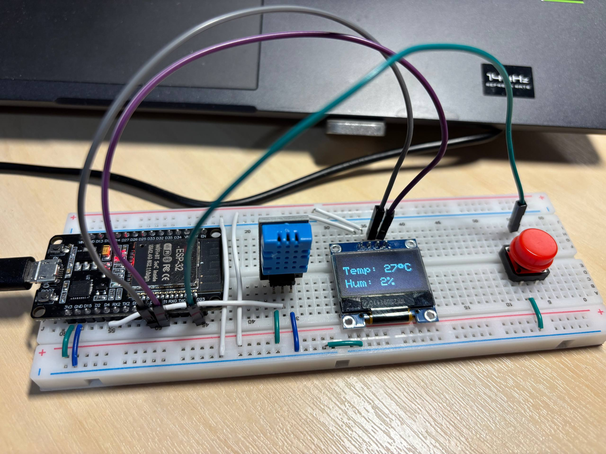
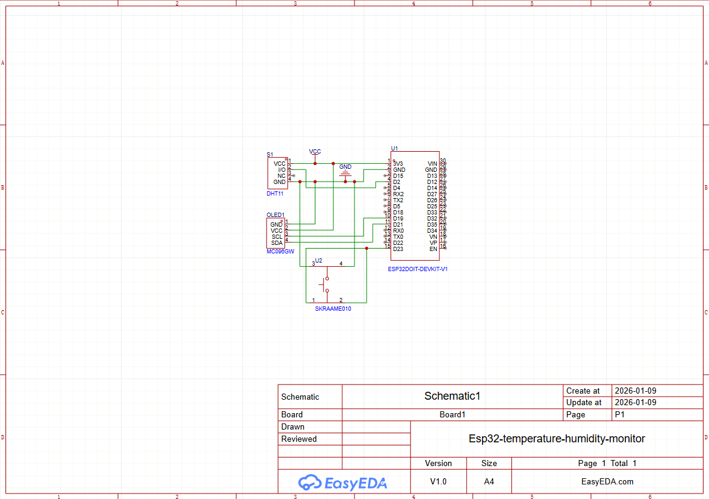
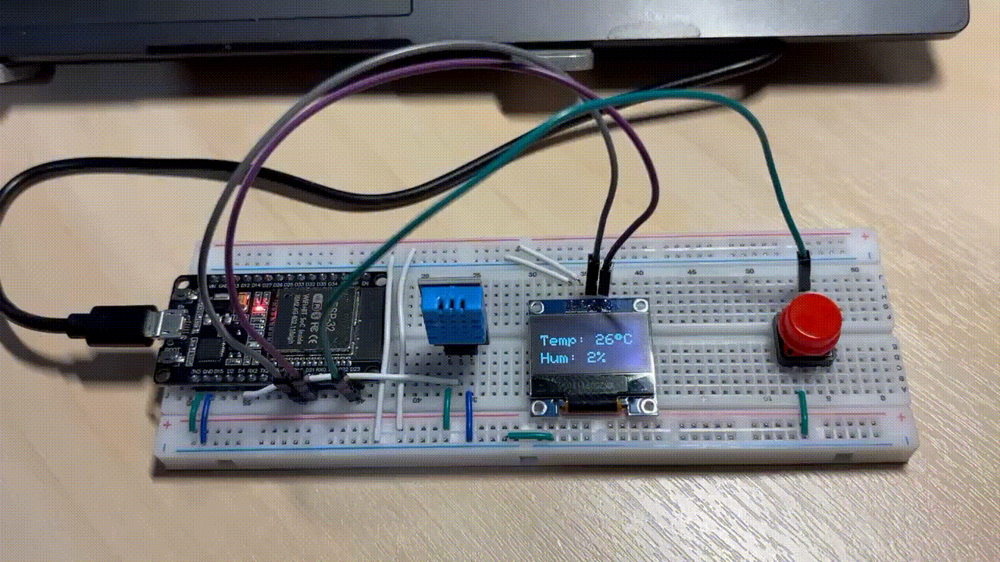

# Esp32 Temperature & Humidity Monitoring System with OLED Display 

## 📌 Overview

This project implements a **temperature and humidity monitor** with an **ESP32 DEVKIT V1** and a **DHT11 Sensor**.
The real-time temperature & humidity will be displayed on an **OLED 128*64 Display**, and user can change between
**Celsius (°C) and Fahrenheit (°F)** via a push button

The project emphasizes core **embedded systems concepts**, including digital I/O, sensor interfacing, timing-based logic, and hardware–software integration for temperature and humidity monitoring.

---

## 🎯 Objectives
- Gain hands-on experience with the ESP32 embedded development environment  
- Interface a temperature and humidity sensor and acquire real-time data  
- Implement timing-based logic for periodic sensor sampling  
- Display sensor data on an OLED display  
- Handle digital inputs using internal pull-up resistors  
- Integrate hardware and software into a complete embedded monitoring system

---

## 🛠 Hardware Components
- ESP32DOIT DEVKIT V1
- OLED 128*64 Display
- Push button
- DHT11 Sensor
- Breadboard & jumper wires

---

## 🔌 Pinout (ESP32 ↔ OLED)

| OLED Pin |     Function    | ESP32 Pin |
|---------|-----------------|-------------|
|   GND   |     Ground      |     GND     |
|   VCC   |     Power       |     3V3      |
|   SCL    |     Clock Signal    |     D19     |
|   SDA    | Data Transfer |     D21      |

## 🔌 Pinout (ESP32 ↔ DHT11)
| DHT11 |     Function    | ESP32 Pin |
|---------|-----------------|-------------|
|   +   |     Power      |     3V3     |
|   OUT   |     Data       |     D4      |
|   -    |     Ground    |     GND     |

### Other Connections

| Component | ESP32 Pin |       Notes       |
|-----------|-------------|-------------------|
|  Button   |     D23      |    INPUT_PULLUP   |

---

## 📐 Wiring Diagram


> The wiring was created using real hardware components

---

## 🧩 Schematic


> The schematic illustrates the logical connections between ESP32, OLED and DHT11

---

## ▶ Demo


---

### Run (PlatformIO)

1. Open this folder in VS Code.
2. Select the correct environment & board in `platformio.ini`.
3. Build/Upload/Monitor using PlatformIO toolbar, or terminal:
```bash
pio run
pio run -t upload
pio device monitor -b 9600
```
---

## 🧠 Implementation Notes
- Periodic temperature and humidity sampling using non-blocking timing logic  
- Sensor data validation to handle invalid or failed readings  
- Real-time display of sensor values on an LCD/OLED  
- Button input handled via internal pull-up resistor  
- Modular integration of sensor, display, and user input logic  

---

## 📚 What I Learned
- Interfacing a 16x2 LCD using the HD44780 protocol
- Designing and documenting pinout, wiring, and schematic
- Handling button input using pull-up configuration
- Implementing timing-based logic in an embedded system
- Structuring a clean and professional GitHub repository for embedded projects

---

## 👤 Author
Hoang Bui - 2nd year Embedded Student

---

## 📄 License
This project is for educational purposes only.